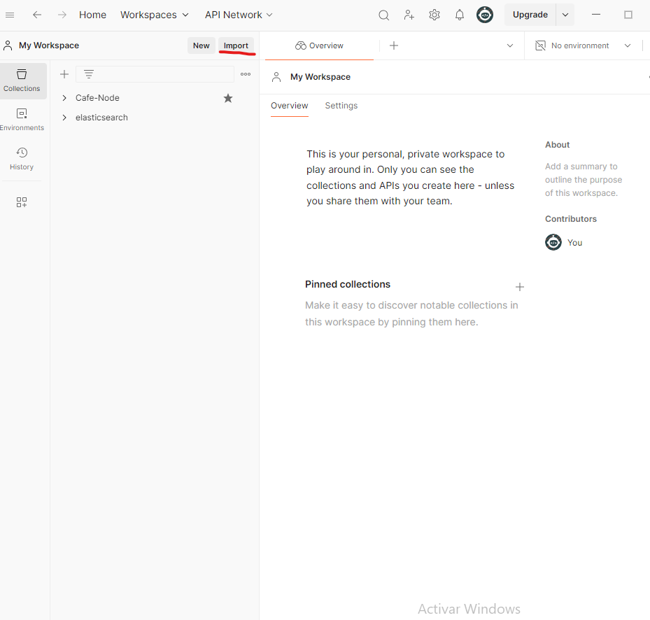
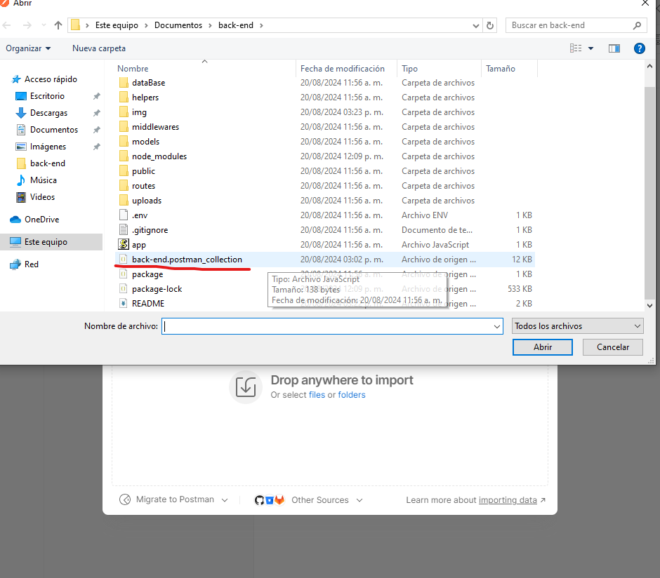

# Perfil-Back-End-

-Javier Eduardo Tarazona Castellanos
## Descripción Historia de Usuario: Gestión de Usuarios y Ventas
gestionar usuarios con roles y permisos para
asegurarme de que sólo las personas autorizadas puedan acceder y modificar los
datos del sistema
1. Gestión de usuarios:
• Crear usuarios con roles (Administrador y Analista) y permisos (lectura y
escritura).
• Consultar la lista de usuarios activos.
• Desactivar usuarios del sistema.
• Cambiar el rol de un usuario.
2. Gestión de ventas:
• Registrar datos de ventas (nombreComprador, totalCompra).
• Consultar los datos de ventas registrados.

## Instalación
1. Clona el repositorio:
   ```bash
   git clone https://github.com/2172015javier/back-end.git
   ```
2. Navega al directorio del proyecto:
   ```bash
   cd back-end
   ```
3. Instala las dependencias:
   ```bash
   npm install
   ```
4. Instala las dependencias:
   ```bash
   npm start
   ```
## Pruebas 
1. Descargar la aplicacion Postman crear un usuario e ingresar
2. Importar el archivo bk.postman_collection.json

